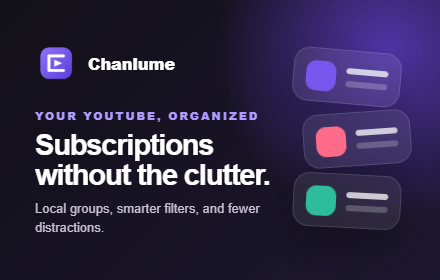
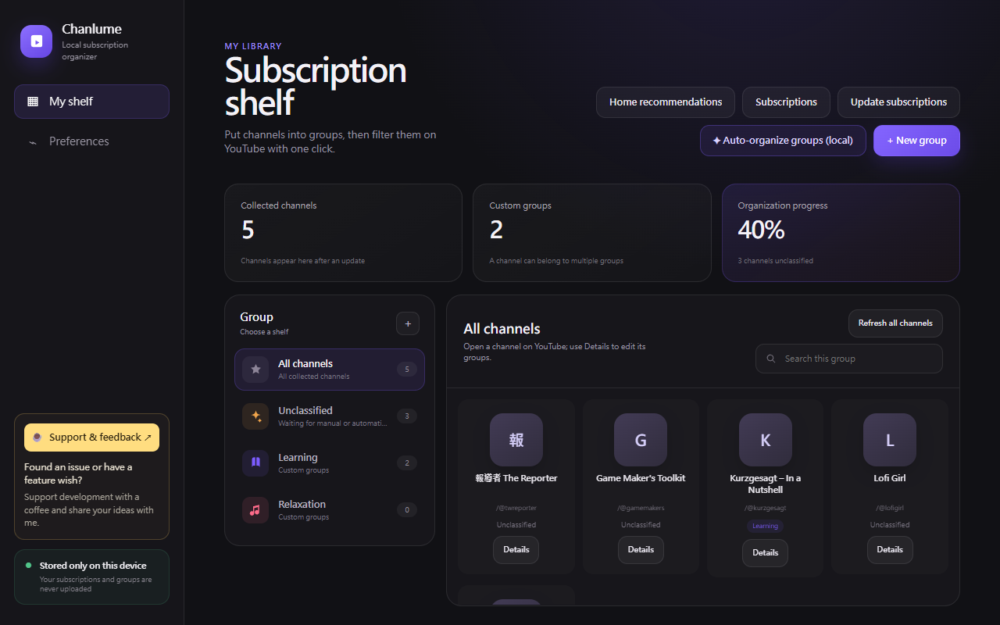
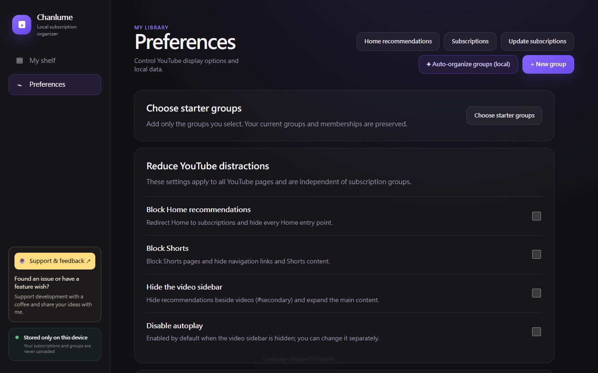

# Chanlume

<p align="center">
  
</p>

<p align="center">
  <strong>Your YouTube subscriptions, organized your way.</strong><br>
  Organize YouTube subscriptions into groups, follow favorites, and hide distractions. Your library stays in your browser.
</p>

<p align="center">
  No account · No server · No telemetry · No cloud AI
</p>

> 繁體中文簡介：Chanlume 是一個把 YouTube 訂閱變成「自己的書架」的 Chrome / Edge 擴充套件。你可以建立群組、直接在 YouTube 裡分類頻道、隱藏干擾內容，並使用完全在本機運作的自動分類。

## Preview



## Download & install

**[Download Chanlume 1.19.3](https://github.com/TANANIS/Chanlume/raw/refs/heads/main/outputs/Chanlume-1.19.3.zip)**

[Chrome Web Store listing](https://chromewebstore.google.com/detail/agnnbehkdkdkflknblhkmgciaekngole): the published item retains its previous name until this update is submitted, approved and published.

### What's new in 1.19.3

- Renamed the interface, runtime messages, code globals, DOM/CSS namespaces, backup filenames and packaging to Chanlume.
- Existing local subscriptions, groups, favorites, settings and optional API keys migrate without resetting the library. Older JSON backups and saved group/Favorites links remain compatible.
- The package is available here on GitHub. The developer reported uploading it to Chrome Web Store on October 8, 2026; review and publication status have not been verified.

### What's new in 1.19.2

- Auto-organize now classifies all unfiled channels immediately, without a review or confirmation step. Each channel gets its best matching group; channels without enough information go into Other. Existing classifications are preserved and every assignment remains editable.
- A Favorites view on YouTube with a searchable picker, up to six newest public videos per channel, publication dates, refresh and per-channel retry. Favorites persist separately from groups.
- Dashboard cards open channels on YouTube, with a separate Details button; Manage members uses searchable checkbox rows; bulk edits stage and commit as one delta.
- Improved auto-grouping classification: handles script variants, strips contact noise, separates game development, science, stories, camping/survival and VTuber.
- Optional starter groups from onboarding and Preferences.
- A single global power button to pause or resume Chanlume on YouTube; groups and preferences are preserved.

The local automated checks pass: 69 unit/static/background tests plus UI, favorites, classification, onboarding, performance and power-toggle browser harnesses. See [performance findings](PERFORMANCE.md) for the synthetic benchmark and its limits.


Package SHA-256: `6433d361fdf43637a47f665c3337b2f99d7dfb898e99465ba3b9ec7bb88e8cbb`.

### Chrome

The currently published extension is available from the [Chrome Web Store](https://chromewebstore.google.com/detail/agnnbehkdkdkflknblhkmgciaekngole?utm_source=item-share-cb).

For manual installation:

1. Download `Chanlume-1.19.3.zip` from the download link above.
2. Extract the ZIP file.
3. Open `chrome://extensions/`.
4. Enable **Developer mode**.
5. Select **Load unpacked**.
6. Choose the extracted folder that contains `manifest.json`.
7. Reload any YouTube tabs that were already open.

### Edge

Use the same steps from `edge://extensions/`.

Developers can also clone this repository and load the `extension` directory directly.

## Why Chanlume?

YouTube recommendations and YouTube subscriptions serve different purposes.

Chanlume keeps those two experiences separate: your Home page can remain driven by YouTube's recommendation algorithm, while your Subscriptions page becomes a space you organize yourself.

Instead of replacing YouTube, Chanlume adds a lightweight organization layer directly into it.

## What you can do

### Organize subscriptions your way

- Create custom groups with your own names, colors, and icons.
- Put the same channel in multiple groups.
- Switch groups directly from YouTube's sidebar or Subscriptions page; the sidebar group list starts collapsed to save space.
- See each stored channel's group directly beneath its video preview metadata in the Subscriptions feed.
- Classify a channel beside the Subscribe button on channel and watch pages.
- Pause or resume Chanlume's YouTube integration with the popup power button; your groups and preferences stay saved.
- Newly subscribed channels can enter **Unclassified** automatically; unsubscribed channels are removed from Chanlume automatically.
- Chanlume's YouTube-integrated controls follow YouTube's light and dark themes.

### Reduce recommendation-driven distractions

Chanlume lets you independently choose whether to:

- block the YouTube Home page and redirect to Subscriptions;
- hide Shorts and its navigation entry;
- hide the recommendation sidebar on watch pages;
- disable autoplay;
- hide already-watched videos from your subscription feed.

These controls are separate from subscription groups, so you can keep as much or as little of the original YouTube experience as you want.

### Auto-organize locally

Chanlume can classify unfiled channels in one click without sending your subscription library to a cloud AI service.

Suggestions can use:

- channel names and public descriptions;
- channel keywords;
- recurring topics from recent video titles;
- a built-in multilingual topic dictionary;
- optional public YouTube topic/category metadata;
- vocabulary learned from your own manual corrections.

Auto-organize uses the strongest available result, including low-confidence matches. Channels without a usable result go into **Other**. Changes are saved immediately; you can adjust them afterward with the ordinary group editing controls. Existing classifications are never overwritten automatically.

### Private by default

Chanlume stores your groups, channels, preferences, and learned classifications in `chrome.storage.local`.

There is:

- no Chanlume account;
- no Chanlume server;
- no telemetry or analytics;
- no advertising profile;
- no cloud AI classification.

If you optionally add your own YouTube Data API key, Chanlume sends public channel/video IDs directly to Google's YouTube Data API to retrieve public metadata. The key stays on your device and is excluded from JSON backups.

See [PRIVACY.md](PRIVACY.md) for the full privacy policy.

## Screenshots

### Subscription shelf


### Preferences



## Getting started

1. Open [YouTube's subscribed channels page](https://www.youtube.com/feed/channels).
2. Open Chanlume from the browser toolbar and choose **Update subscriptions**.
3. Chanlume will load your subscribed channels and save the collected public channel information locally.
4. Open **Manage groups**.
5. Create groups manually, or select **Auto-organize groups (local)** to classify all unfiled channels immediately.
6. Adjust any assignments afterward with **Details** or **Manage members**.
7. Return to YouTube and switch shelves directly from the YouTube interface.

You can also classify the channel you are currently watching from the **Groups** control beside its Subscribe button.

## How local classification works

Chanlume's classifier ranks local signals to choose a destination for each unfiled channel.

It scores signals such as channel descriptions, keywords, recent video titles, known topic phrases, exclusions, official YouTube categories, and vocabulary learned from manual group assignments.

The highest-scoring usable result becomes the channel's initial group. Confidence still helps describe the result internally, but does not require a user decision. Channels without enough usable signals go into Other.

There is no initial classification review or confirmation step. The progress dialog closes after saving, and the updated groups appear immediately. Existing group editing supports corrections and multiple group memberships. A failed save offers retry, and cancellation during analysis prevents the classification commit.

## Optional: YouTube Data API

Chanlume works without an API key.

If you want additional public classification signals, you can enable **YouTube Data API v3** in your own Google Cloud project and paste your API key into Chanlume Preferences.

When enabled, Chanlume can use public YouTube channel topics, video categories, and related metadata alongside the local classifier.

Your API key:

- is stored locally;
- is not included in Chanlume JSON exports;
- is sent only to Google's YouTube Data API when that feature is used.

## Backup and transfer

Chanlume can export and import your local library as JSON.

Exports include your groups and channel URLs. Sensitive values such as your YouTube Data API key are not included.

You can also clear Chanlume's local data without changing your actual YouTube subscriptions.

## Languages

Chanlume currently supports:

- English
- 繁體中文

The default interface is English unless a Traditional Chinese browser locale is detected. Changing the UI language does not rename your channels or custom groups.

## Technical notes

- Chrome Extension Manifest V3
- Vanilla JavaScript, HTML, and CSS
- Local state stored with `chrome.storage.local`
- Incremental YouTube DOM observation instead of repeatedly rescanning the entire page
- Background tabs pause DOM observation to reduce unnecessary work
- Supports multiple generations of YouTube video/channel renderers
- JSON backup and restore
- Node.js unit tests plus Playwright UI smoke tests

## Development and verification

Core checks can be run with Node.js:

```powershell
node --test tests/shared.test.js
node --check extension/shared.js
node --check extension/content/content.js
node --check extension/popup/popup.js
node --check extension/dashboard/dashboard.js
```

The repository also includes UI smoke tests for the dashboard, onboarding flow, popup, group management, localization, and YouTube-integrated controls.

## Current limitations

YouTube is a continuously changing single-page application. Chanlume depends on public page structure and public metadata, so future YouTube UI changes may occasionally require selector or parser updates.

Subscription discovery may automatically scroll YouTube's subscribed-channels page until the list stabilizes. Classification quality also depends on the public metadata available for each channel; uncertain results intentionally remain unclassified.

## Project principles

Chanlume currently focuses on three principles:

1. **User control over recommendation-driven behavior.**
2. **Local-first organization and privacy.**
3. **Automation that stays inspectable and reversible.**

## License

Chanlume is released under the [MIT License](LICENSE).

## Disclaimer

Chanlume is an independent project and is not affiliated with, endorsed by, or sponsored by YouTube, Google, or PocketTube.

The original feature concept was inspired by subscription-management tools such as PocketTube, while Chanlume's implementation, interface, local classifier, and product direction are independently developed.
